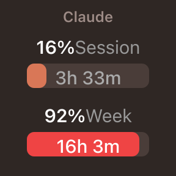

<div align="center">



# AI Usage Limits - Stream Deck Plugin

**See exactly how much of your AI coding quota is left, right on your Stream Deck keys and dials.**

Track usage limits and reset times for **Claude**, **Codex**, **Antigravity**, **Gemini CLI**, and **MiniMax** at a glance, without ever opening a terminal or a billing page.

[](https://marketplace.elgato.com/product/ai-usage-limits-b78ef6c4-0165-4bf2-8ba8-889f723e915f)

[](LICENSE)
[](#requirements)
[](https://www.elgato.com/stream-deck)
[](https://www.typescriptlang.org/)
[](#actions)

</div>

---

## Why you'll like it

- **Five providers, one glance:** Claude, Codex, Antigravity, Gemini CLI and MiniMax, each with its own action and brand-matched theme.
- **Keys *and* dials:** every action renders on standard keys **and** on Stream Deck+ encoders with a full dial layout.
- **Live progress bars:** color-coded usage (green, amber, red) plus human-friendly reset countdowns like `3h 33m` or `4d 3h`.
- **Zero key juggling for most providers:** reuses the credentials your existing CLIs already created locally. Only MiniMax needs a key pasted in.
- **Always fresh:** usage is polled and cached automatically, so the keys stay current without hammering provider APIs.
- **Powered by a typed SDK:** all the provider logic lives in the reusable [`@lenadweb/ai-limits`](https://github.com/lenadweb/ai-limits) library.

---

## Install

### From the Elgato Marketplace (recommended)

The easiest way, no build tools required:

**[Get *AI Usage Limits* on the Elgato Marketplace](https://marketplace.elgato.com/product/ai-usage-limits-b78ef6c4-0165-4bf2-8ba8-889f723e915f)**

Click **Download**, open the file, and Stream Deck installs the plugin automatically. Then find **AI Usage Limits** in the actions list and drag any provider onto a key or dial.

### From source (for development)

```bash
# 1. Install dependencies
npm install

# 2. Build the plugin
npm run build

# 3. Develop with live reload (auto-restarts the plugin in Stream Deck)
npm run watch
```

Then open the **Stream Deck** app, find **AI Usage Limits** in the actions list, and drag any provider onto a key or dial.

---

## Requirements

| Requirement | Version |
|---|---|
| **Stream Deck application** | 6.9 or newer |
| **Operating system** | macOS 12 (Monterey) or newer |
| **Node.js** | 20 or newer |
| **Elgato CLI** (`@elgato/cli`) | installed as a dev dependency |

> The provider logic is cross-platform, but the packaged plugin currently ships **macOS-only** (declared in `manifest.json`). Windows support is on the roadmap.

---

## Actions

Each provider is a separate action. All of them work on **Keypad** (keys) and **Encoder** (Stream Deck+ dials).

| Action | What it shows | UUID |
|---|---|---|
| **Progress Bars (Claude)** | Claude Code session & weekly usage | `com.len.limits.progress` |
| **Progress Bars (Codex)** | Codex / ChatGPT plan usage | `com.len.limits.codex.progress` |
| **Progress Bars (Antigravity)** | Antigravity (Claude + Gemini) usage | `com.len.limits.antigravity` |
| **Progress Bars (Gemini CLI)** | Gemini CLI quota usage | `com.len.limits.gemini-cli` |
| **Progress Bars (MiniMax)** | MiniMax M-series coding-plan usage | `com.len.limits.minimax` |

---

## Provider setup

For most providers the plugin simply reads the credentials your CLI already wrote to disk, no copy-pasting tokens.

| Provider | How it authenticates | Where credentials come from |
|---|---|---|
| **Claude** | Automatic | macOS Keychain (`Claude Code-credentials`), falling back to `~/.claude/.credentials.json` |
| **Codex / ChatGPT** | Automatic | `~/.codex/auth.json` |
| **Gemini CLI** | Automatic | `~/.gemini/oauth_creds.json` |
| **Antigravity** | One-time login | Click **Login** in the Property Inspector to start the Google OAuth2 flow; the token is saved to `~/.limits-streamdeck/antigravity_oauth.json` |
| **MiniMax** | API key | Paste your key into the Property Inspector |

> **Tip:** Make sure the matching CLI (Claude Code, Codex, Gemini CLI) is installed and logged in first; that is what creates the credential files the plugin reads.

---

## How it works

```
+---------------------+     reads usage     +-----------------------+
|   Stream Deck key /  |  <----------------  |  @lenadweb/ai-limits   |
|  dial (this plugin)  |   progress + reset  |  (per-provider SDK)    |
+---------------------+                     +----------+------------+
          ^                                            | local creds / API
          | renders bars + countdown                   v
    color-coded SVG                         Claude, Codex, Antigravity,
                                            Gemini CLI, MiniMax
```

The plugin is a thin rendering layer: it asks [`@lenadweb/ai-limits`](https://github.com/lenadweb/ai-limits) for a normalized usage summary per provider, then draws the progress bars and reset countdowns onto the key or dial.

---

## Development scripts

| Script | What it does |
|---|---|
| `npm run build` | Bundles the TypeScript into `com.len.limits.sdPlugin/bin/plugin.js` via Rollup. |
| `npm run watch` | Rebuilds on save and restarts the plugin in Stream Deck (`streamdeck restart`). |
| `npm run release` | Bumps the version, rebuilds, and packs a distributable `.streamDeckPlugin` file. |

---

## Troubleshooting

- **A provider shows no data:** confirm the matching CLI is installed and logged in, and that its credential file exists (see the table above).
- **Antigravity stuck after login:** re-run **Login** from the Property Inspector; the token is cached at `~/.limits-streamdeck/antigravity_oauth.json`.
- **MiniMax shows an error:** double-check the API key in the Property Inspector.
- **Nothing appears after `npm run watch`:** make sure the Stream Deck app is running and on version 6.9+.

---

## Support

- **Marketplace listing:** [AI Usage Limits on Elgato Marketplace](https://marketplace.elgato.com/product/ai-usage-limits-b78ef6c4-0165-4bf2-8ba8-889f723e915f)
- **Bugs & feature requests:** [GitHub issues](https://github.com/lenadweb/stream-deck-ai-limits/issues)

## Contributing

Contributions are welcome! Please read [CONTRIBUTING.md](CONTRIBUTING.md) before opening a pull request, and file ideas or bugs in the [issue tracker](https://github.com/lenadweb/stream-deck-ai-limits/issues).

---

## License

[MIT](LICENSE) (c) [lenadweb](https://github.com/lenadweb)