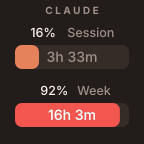
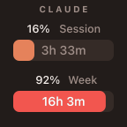
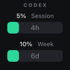
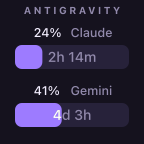
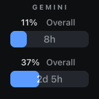
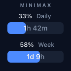
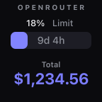
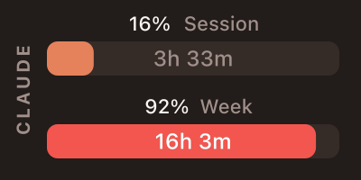
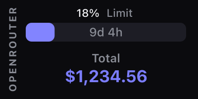
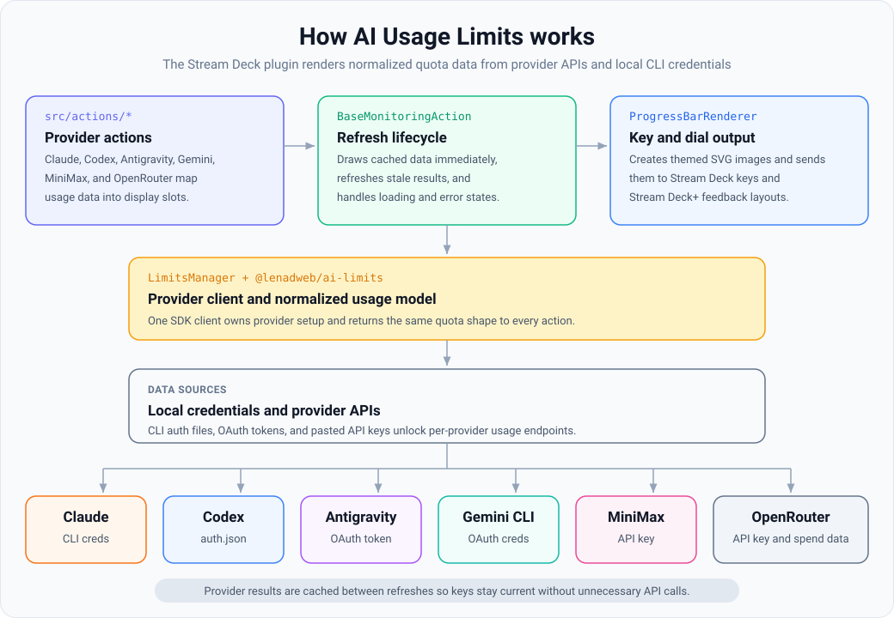

<div align="center">



# AI Usage Limits - Stream Deck Plugin

**See exactly how much of your AI coding quota is left, right on your Stream Deck keys and dials.**

Track usage limits and reset times for **Claude**, **Codex**, **Antigravity**, **Gemini CLI**, **MiniMax**, **OpenRouter**, or any provider configured in **CodexBar** — at a glance, without opening a terminal or a billing page.

[](https://marketplace.elgato.com/product/ai-usage-limits-b78ef6c4-0165-4bf2-8ba8-889f723e915f)

[](LICENSE)
[](#requirements)
[](https://www.elgato.com/stream-deck)
[](https://www.typescriptlang.org/)
[](#actions)

</div>

---

## Why you'll like it

- **Native providers plus CodexBar:** use focused native actions for Claude, Codex, Antigravity, Gemini CLI, MiniMax and OpenRouter; the optional CodexBar backend covers its configured providers from one action.
- **Keys *and* dials:** every action renders on standard keys **and** on Stream Deck+ encoders with a full dial layout.
- **Live progress bars:** color-coded usage (green, amber, red) plus human-friendly reset countdowns like `3h 33m` or `4d 3h`.
- **Zero key juggling for most providers:** reuses the credentials your existing CLIs already created locally. Only MiniMax and OpenRouter need a key pasted in.
- **Always fresh:** usage is polled and cached automatically, so the keys stay current without hammering provider APIs.
- **Powered by a typed SDK:** all the provider logic lives in the reusable [`@lenadweb/ai-limits`](https://github.com/lenadweb/ai-limits) library.

---

## Install

### From the Elgato Marketplace (recommended)

The easiest way, no build tools required:

**[Get *AI Usage Limits* on the Elgato Marketplace](https://marketplace.elgato.com/product/ai-usage-limits-b78ef6c4-0165-4bf2-8ba8-889f723e915f)**

Click **Download**, open the file, and Stream Deck installs the plugin automatically. Then find **AI Usage Limits** in the actions list and drag any provider onto a key or dial.

### From source (for development)

```bash
# 1. Install dependencies
npm install

# 2. Build the plugin
npm run build

# 3. Develop with live reload (auto-restarts the plugin in Stream Deck)
npm run watch
```

Then open the **Stream Deck** app, find **AI Usage Limits** in the actions list, and drag any provider onto a key or dial.

---

## Requirements

| Requirement | Version |
|---|---|
| **Stream Deck application** | 6.9 or newer |
| **Operating system** | macOS 12 (Monterey) or newer, or Windows 10 or newer |
| **Node.js** | 20 or newer |
| **Elgato CLI** (`@elgato/cli`) | installed as a dev dependency |

> The plugin runs on both **macOS** and **Windows**. On macOS, Claude credentials are read from the Keychain; on Windows and Linux they are read from the credential file written by the matching CLI (see [Provider setup](#provider-setup)).

---

## Actions

Each provider is a separate action. All of them work on **Keypad** (keys) and **Encoder** (Stream Deck+ dials).

| Action | What it shows | UUID |
|---|---|---|
| **Claude (Native)** | Claude Code session, weekly or Sonnet weekly usage | `com.len.limits.progress` |
| **Codex (Native)** | Codex session or weekly usage, usage limit resets, credits balance | `com.len.limits.codex.progress` |
| **Antigravity (Native)** | Antigravity (Claude + Gemini) usage, per model | `com.len.limits.antigravity` |
| **Gemini CLI (Native)** | Gemini CLI quota usage, per model | `com.len.limits.gemini-cli` |
| **MiniMax (Native)** | MiniMax M-series daily or weekly usage | `com.len.limits.minimax` |
| **OpenRouter (Native)** | OpenRouter key spend limit & spend by day/week/month | `com.len.limits.openrouter` |
| **CodexBar backend** | Any enabled CodexBar provider, account and quota window | `com.len.limits.codexbar` |

### One metric per tile

Every action has a **Layout** setting:

- **Bars** (default) — the two-slot view, now with a metric picker for each slot.
- **Ring** — one large ring gauge showing a single metric, with its reset countdown in the middle.

Place the same action more than once to build a row of tiles, e.g. Claude Session, Claude Week, Codex Session and Codex Week side by side. Each tile keeps its own metric, and all tiles of a provider share a single API call, so extra tiles cost nothing. MiniMax and OpenRouter tiles carry their own API key, so they are fetched once per distinct key — several tiles on the same key still cost one call, and tiles on different keys each show their own account.

> **Codex note:** OpenAI currently exposes only a weekly window on Plus, Pro and Business plans ([issue #6](https://github.com/lenadweb/stream-deck-ai-limits/issues/6)). The plugin classifies windows by the duration the API reports, so the weekly usage lands on the **Weekly limit** metric even when the API delivers it in the primary slot. A tile set to **Session limit** shows `no data` until OpenAI brings the 5-hour window back.

---

## Provider setup

For most providers the plugin simply reads the credentials your CLI already wrote to disk, no copy-pasting tokens.

| Provider | How it authenticates | Where credentials come from |
|---|---|---|
| **Claude** | Automatic | macOS: Keychain (`Claude Code-credentials`), falling back to `~/.claude/.credentials.json`. Windows: `%USERPROFILE%\.claude\.credentials.json` |
| **Codex / ChatGPT** | Automatic | `~/.codex/auth.json` |
| **Gemini CLI** | Automatic | `~/.gemini/oauth_creds.json` |
| **Antigravity** | One-time login | Click **Login** in the Property Inspector to start the Google OAuth2 flow; the token is saved to `~/.limits-streamdeck/antigravity_oauth.json` |
| **MiniMax** | API key | Paste your key into the Property Inspector |
| **OpenRouter** | API key | Paste a key from [openrouter.ai/keys](https://openrouter.ai/keys); pick what each bar shows (limit / spend by day, week, month, total) |
| **CodexBar backend** | Local CodexBar server | Start `codexbar serve`; configured providers load automatically when opening this action's settings |

> **Tip:** Make sure the matching CLI (Claude Code, Codex, Gemini CLI) is installed and logged in first; that is what creates the credential files the plugin reads.

---

## CodexBar backend (optional)

The **CodexBar backend** action reads the local [`codexbar serve`](https://github.com/steipete/CodexBar) JSON API. It is useful for providers that do not have a dedicated native action here, while native actions remain independent and continue to work without CodexBar.

1. Install and configure CodexBar for the providers you use.
2. Start the local server: `codexbar serve` (the default address is `127.0.0.1:8080`).
3. Drag **CodexBar backend** onto a key or dial.
4. Its settings automatically load enabled providers. Choose a provider, account, and one or two quota windows; use the refresh icon if you change your CodexBar configuration. A non-default local port can be set in **Advanced** before loading.

The plugin connects only to `127.0.0.1`; it does not send CodexBar data or credentials to a remote host. CodexBar's desktop app and this backend action are macOS-oriented.

In addition to quota windows, the action exposes every provider-specific value reported by CodexBar. For OpenRouter this includes credits, API-key budget and spend, and the reported rate limit; each can be selected as a ring or bar metric.

In **Advanced**, you can start `codexbar serve`, see its status, and stop a server started by the current Stream Deck session. Server port and auto-start are shared by every CodexBar backend action, so multiple tiles use one server. You can also enable **Start CodexBar automatically if it isn't running**. This opt-in setting starts a locally installed CodexBar CLI only after the plugin cannot reach its configured loopback server.

---

## How it looks

Each provider renders on both keys and Stream Deck+ dials, with a brand‑matched theme and a rounded usage bar that shows the reset countdown inside it.

<div align="center">

&nbsp;&nbsp;

&nbsp;&nbsp;

&nbsp;

**[See the full gallery — keys & dials for every provider →](docs/showcase.md)**

</div>

---

## How it works

<p align="center">
  
</p>

The plugin is a thin rendering layer: it asks [`@lenadweb/ai-limits`](https://github.com/lenadweb/ai-limits) for a normalized usage summary per provider, then draws the progress bars and reset countdowns onto the key or dial.

---

## Development scripts

| Script | What it does |
|---|---|
| `npm run build` | Bundles the TypeScript into `com.len.limits.sdPlugin/bin/plugin.js` via Rollup. |
| `npm run watch` | Rebuilds on save and restarts the plugin in Stream Deck (`streamdeck restart`). |
| `npm run release` | Bumps the version, rebuilds, and packs a distributable `.streamDeckPlugin` file. |

---

## Troubleshooting

- **A provider shows no data:** confirm the matching CLI is installed and logged in, and that its credential file exists (see the table above).
- **Antigravity stuck after login:** re-run **Login** from the Property Inspector; the token is cached at `~/.limits-streamdeck/antigravity_oauth.json`.
- **MiniMax shows an error:** double-check the API key in the Property Inspector.
- **Nothing appears after `npm run watch`:** make sure the Stream Deck app is running and on version 6.9+.

---

## Support

- **Marketplace listing:** [AI Usage Limits on Elgato Marketplace](https://marketplace.elgato.com/product/ai-usage-limits-b78ef6c4-0165-4bf2-8ba8-889f723e915f)
- **Bugs & feature requests:** [GitHub issues](https://github.com/lenadweb/stream-deck-ai-limits/issues)

## Contributing

Contributions are welcome! Please read [CONTRIBUTING.md](CONTRIBUTING.md) before opening a pull request, and file ideas or bugs in the [issue tracker](https://github.com/lenadweb/stream-deck-ai-limits/issues).

---

## License

[MIT](LICENSE) (c) [lenadweb](https://github.com/lenadweb)
