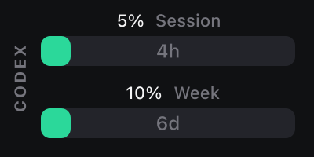
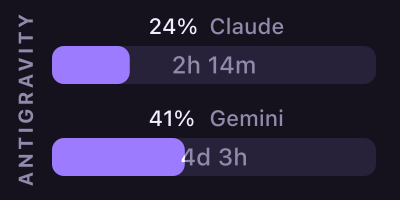
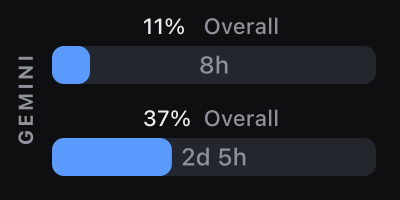
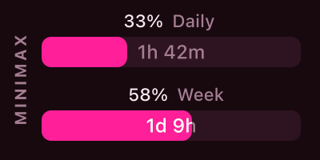

# How it looks

Every provider renders on both **keys** (144×144) and **Stream Deck+ dials** (200×100), with a brand‑matched theme, a rounded usage bar with the reset countdown inside it, and a color‑coded state (normal → amber → red).

The previews below are generated straight from the plugin's own renderer (see [`generated/provider-assets`](../generated/provider-assets)).

---

## Claude

Session and weekly windows with reset countdowns.

| Key | Dial |
|:---:|:---:|
|  |  |

## Codex

Codex / ChatGPT plan usage for the current session and week.

| Key | Dial |
|:---:|:---:|
|  |  |

## Antigravity

Per‑model usage (e.g. Claude and Gemini) on a single key.

| Key | Dial |
|:---:|:---:|
|  |  |

## Gemini CLI

Overall (most‑constrained) quota, or a specific model you pick.

| Key | Dial |
|:---:|:---:|
|  |  |

## MiniMax

Daily and weekly coding‑plan usage.

| Key | Dial |
|:---:|:---:|
|  |  |

## OpenRouter

A key **limit** renders as a usage bar, while spend windows (today / week / month / total) render as a **headline dollar value** — so an unlimited key never shows an empty bar.

| Key | Dial |
|:---:|:---:|
|  |  |

---

> Tip: the provider name above the bars can be hidden per action via **Display → Show provider name** in the Property Inspector, which gives the metrics a little more room.
